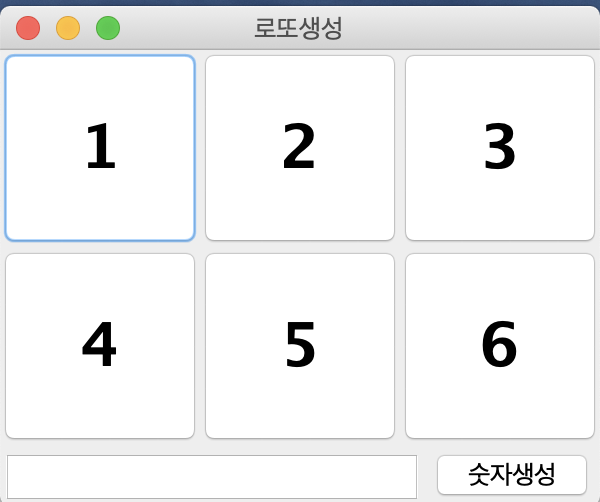
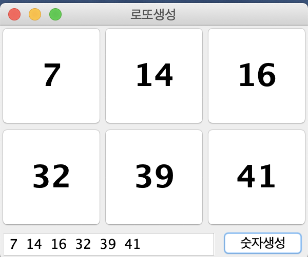
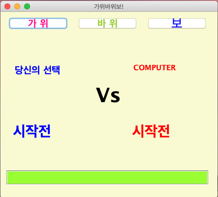
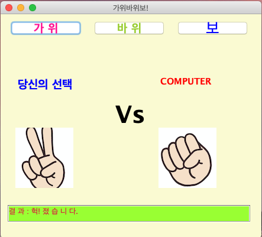
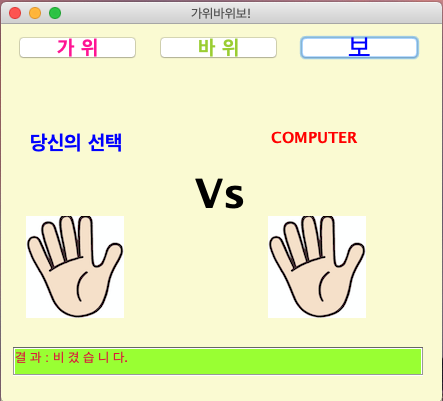
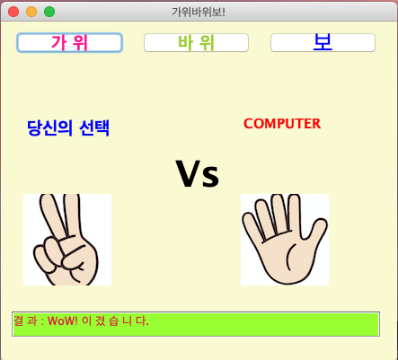

## 아래 요구사항에 맞게 구현하세요. 
### 1. 랜덤로또생성기
- 요구사항
  - 숫자생성 버튼 클릭시 1 ~ 45 숫자로 6개 난수 생성하여 화면에 표현
  - 단, 6개 숫자는 중복이 되면 안됨
  - 하단에 선택된 숫자를 나열
  
  
### [버튼 클릭전]
  
   
### [숫자생성 버튼 클릭 후]

   
### 2. 가위바위보
- 요구사항
  - 가위, 바위, 보 이미지
  - 사용자는 선택으로 컴퓨터는 랜덤으로 값 선택
  - 하단에 결과 
  
### [버튼 클릭전]  

### [진경우]

### [비길경우]

### [이긴경우]
  
