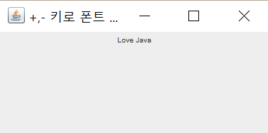
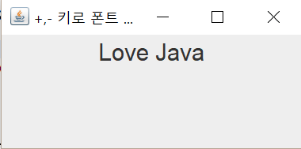
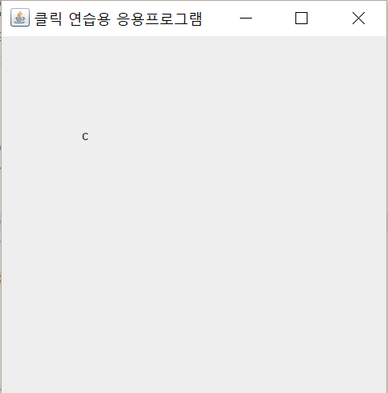
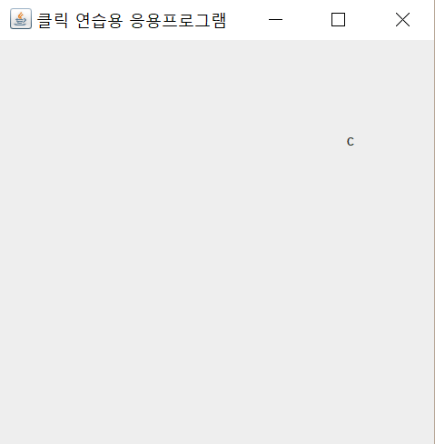
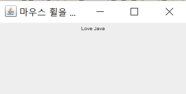
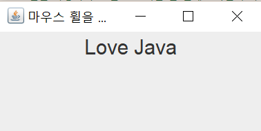

##  실습문제
### 1. JLabel 컴포넌트는 Mouse 이벤트를 받을 수 있다. JLabel 컴포넌트에 마우스를 올리면<br> "Love Java"가, 내리면 "사랑해"가 출력되도록 스윙 응용프로그램을 작성하라.
     
  
### 2. 컨텐트팬의 배경색은 초록색으로 하고 마우스를 드래깅하는<br>동안만 노란색으로 유지하는 스윙 응용프로그램을 작성하라.
   

### 3. JLabel을 활용하여 "Love Java"를 출력하고 왼쪽 화살표 키 <Left> 키를 입력할 때마다 "avaJ evoL"와 "Love Java"를 번갈아 출력하는 스윙 프로그램을 작성하라. StringBuffer 클래스의 reverse() 메소드를 이용하여 구현하는 것과 JLabel에 포커스를 설정하는 것을 잊지 말아야 한다.
     

### 4. JLabel을 활용하여 "Love Java"를 출력하고 왼쪽 화살표 키 <Left> 키를 입력할 때마다 "ove JavaL", "ve JavaLo", "e JavaLov" 등과 같이 계속 한 문자씩 왼쪽으로 이동하는 스윙 프로그램을 작성하라. 문자열의 이동은 String 클래스의 substring()메소드를 이용하여 구현하라. String text = "Love Java"인 경우, text.substring(0, 1)은 "L"을 리턴하고, text.substring(1)은 "ove Java"를 리턴한다. JLabel에 포커스 설정하는 것을 잊지 말아야 한다.

       

### 5. JLbel 컴포넌트는 Key 이벤트를 받을 수 있다. JLabel 컴포넌트를 이용하여 "Love Java"를 출력하고 +키를 치면 폰트 크기를 5픽셀씩 키우고, -키를 치면 폰트 크기를 5픽셀씩 줄이는 스윙 응용프로그램을 작성하라. 5픽셀 이하로 작아지지 않도록 하라.

- 힌트
  - JLabel 컴포넌트에 폰트를 설정하는 방법은 다음과 같다.
```
JLabel la = new JLabel("Love Java")
la.setFont(new Font("Arial", Font.PLAIN, 10)); Arial 폰트로 10픽셀 크기
Font f = la.getFont();
int size = f.getSize();
la.setFont(new Font("Arial", Font.PLAIN, size+5)); //15픽셀 
```
    

### 6. 클릭 연습용 스윙 응용프로그램을 작성하라. JLabel을 이용하여 문자열이 "C"인 레이블을 하나 만들고 초기 위치를 (100, 100)으로 하라. 문자열을 클릭할 때마다 레이블은 프레임 내의 랜덤한 위치로 움직인다.
- 힌트
  - 배치관리자를 삭제하면 레이블이 임의의 위치로 움직일 수 있다.
  
    

### 7. JLbel을 활용하여 "Love Java"를 출력하고, "Love Java" 글자 위에 마우스를 올려 마우스 휠을 위로 굴리면 글자가 작아지고, 아래로 굴리면 글자가 커지도록 프로그램을 작성하라. 폰트 크기는 한 번에 5픽셀씩 작아지거나 커지도록 하고, 5픽셀 이하로 작아지지 않도록 하라.
- 힌트
  - 마우스 휠이 굴려질 때마다 MouseWheelEvent가 발생하며 MouseWheelListener의 mouseWheelMoved(MouseWheelEvent e) 메소드가 호출된다. 이때 매개 변수 e 객체를 다음과 같이 이용하면 마우스 힐이 위로 굴려졌는지 아래로 굴려졌는지 알 수 있다.
```
int n = e.getWheelRotation();
``` 
n이 음수이면 마우스 휠이 위로 굴려졌고, 양수이면 아래로 굴려졌다. 실제 n은 -1 혹은 1 중 하나이다. 핵심적인 코드는 다음과 같다.
```
label.addMouseWheelListener(new MouseWheelListener() {
  public void mouseWheelMoved(MouseWheelEvent e) {
   int n = e.getWheelRotation();
   if(n < 0) { // up direction. 폰트 5픽셀 작게
    ......... 
   }
   else { // down direction. 폰트 5픽셀 크게
    ..........
   }
 }
});
``` 
  
    
  
