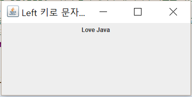

## GUI 실습문제
### 1. JLabel 컴포넌트는 Mouse 이벤트를 받을 수 있다. JLabel 컴포넌트에 마우스를 올리면<br> "Love Java"가, 내리면 "사랑해"가 출력되도록 스윙 응용프로그램을 작성하라.
  
  
  
### 2. 컨텐트팬의 배경색은 초록색으로 하고 마우스를 드래깅하는<br>동안만 노란색으로 유지하는 스윙 응용프로그램을 작성하라.
  


### 3. JLabel을 활용하여 "Love Java"를 출력하고 왼쪽 화살표 키 <Left> 키를 입력할 때마다 <br>"avaJ evoL"와 "Love Java"를 번갈아 출력하는 스윙 프로그램을 작성하라.<br>StringBuffer 클래스의 reverse() 메소드를 이용하여 구현하는 것과<br>JLabel에 포커스를 설정하는 것을 잊지 말아야 한다.
  
  

### 4. JLabel을 활용하여 "Love Java"를 출력하고 왼쪽 화살표 키 <Left> 키를 입력할 때마다 <br>"ove JavaL", "ve JavaLo", "e JavaLov" 등과 같이 계속 한 문자씩 왼쪽으로 이동하는<br>스윙 프로그램을 작성하라. 문자열의 이동은 String 클래스의 substring()메소드를 이용하여 구현하라.<br>String text = "Love Java"인 경우, text.substring(0, 1)은 "L"을 리턴하고,<br> text.substring(1)은 "ove Java"를 리턴한다.<br>JLabel에 포커스 설정하는 것을 잊지 말아야 한다.
- 힌트
  - 컴포넌트의 배경색을 노란색으로 설정하려면 comp.setBackground(Color.YELLOW);로 하면된다.
  
    

### 5. GridLayout을 이용하여 다음 그림과 같이<br>16개의 색을 배경색으로 하는 4*4 바둑판을 구성하라.

- 힌트
  - 16개의 JLabel 컴포넌트를 생성하고 각 레이블 컴포넌트의 배경색을 칠한 다음 하나씩 GridLayout을 가진 컨테이너에 붙이면 된다.
    

### 6. 20개의 10 * 10 크기의 JLabel 컴포넌트가 프레임 내에 (50,50)<br>위치에서 (250,250) 영역에서 랜덤한 위치에 출력되도록 스윙프로그램을 작성하라.<br>프레임의 크기는 300*300으로 하라. 

- 힌트
  - JLabel 컴포넌트의 위치를 랜덤하게 설정하기 위해 (x,y) 좌표는 다음과 같이 구한다.
  
```
int x = (int) (Math.random()*200) + 50; // 50~250
int y = (int) (Math.random()*200) + 50; // 50~250
label.setLocation(x,y); // label을 (x,y)에 배치
label.setSize(10,10); // label 크기를 10x10으로 설정
label.setOpaque(true); // label에 배경색이 보이게함 
```

    
  


