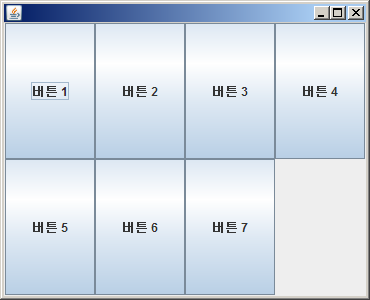
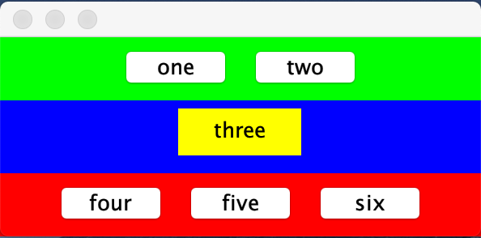
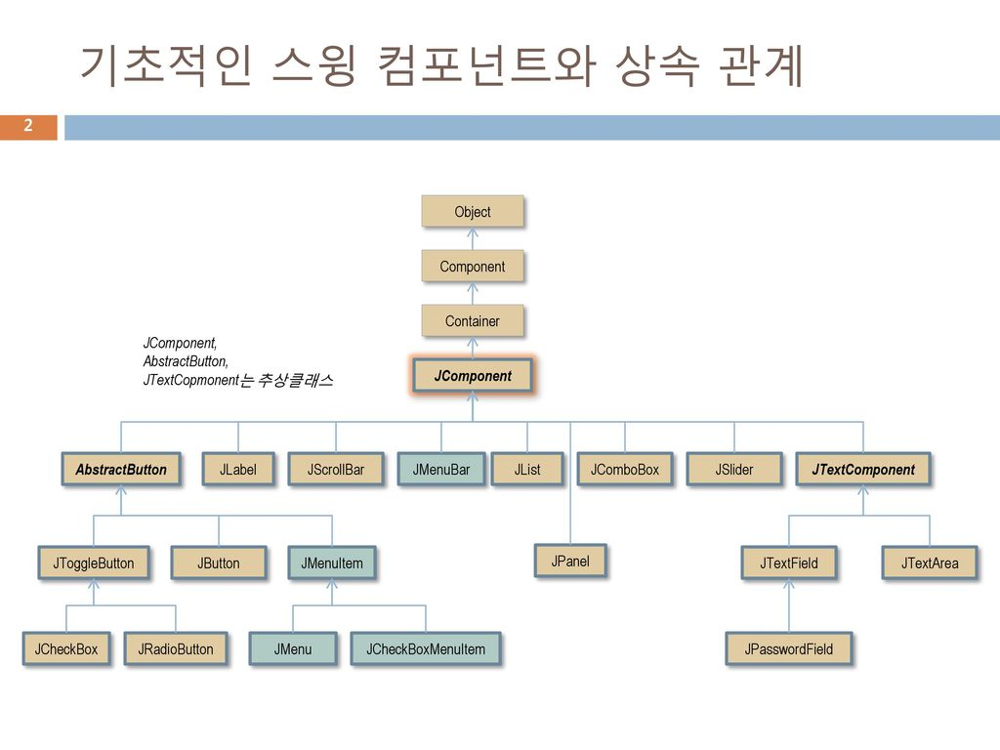

GUI 프로그래밍
===========

## 1. AWT
* java.awt 패키지 : GUI 구축을 위한 클래스들의 모임
* java.awt 패키지의 클래스 계층 구조

  

### 1.1 Container 클래스
- 컴포넌트를 담는 그릇 역할을 하는 클래스
- Frame, Window, Dialog, FileDialog, Panel, Applet 등의 하위 클래스를 가지고 있다
  컨테이너는 서브(Sub) 컨테이너를 가질 수 있다.
- 일반적으로 서브 컨테이너로 Panel 클래스가 많이 사용된다.

## 2. 배치 관리자(Layout Manager)
- 레이아웃은 컴포넌트를 어떤 방식으로 위치시킬 것인지를 나타내는 것으로 AWT에 있는 Container들은 모든
  레이아웃 매니저(Layout Manager)라는 것을 포함하고 있으며 레이아웃 매니저는 컨테이너 객체에 소속되어
  있는 자식 컴포넌트들의 배치를 도와주는 객체이다.
  
### 2.1 FlowLayout
- 컴포넌트를 일렬로 배치


### 2.2 BorderLayout
- 컴포넌트를 추가할 때 방향을 지정하여 추가할 수 있는 기능을 제공, 지정할 수 있는 레이아웃 매니저
- 방향은 동, 서, 남, 북, 중앙 다섯개의 영역으로 배치한다.
- East, West, South, North, Center
- 생성자
  - BorderLayout()
  - BoderLayout(int hgap, int vgap)
  - hgap, vgap : 컴포넌트들 사이의 간격을 의미하며 픽셀단위로 지정
  - 컴포넌트를 추가하는 add() 메소드에 방향을 지정
  - void add(String name, Component comp)
    


### 2.3 Gridlayout
- 컴포넌트를 행과 열을 가진 배열 형태로 배치하는 레이아웃 매니저
- 생성자
  - Gridlayout()
  - Gridlayout(int rows, int cols)
  - Gridlayout(int rows, int cols, int hgap, int vgap)
  - rows, cols : 배치할 행과 열
  - hgap, vgap : 컴포넌트들 사이의 간격, 픽셀 단위
  


### 2.4 Panel 클래스
- Container 클래스로부터 상속된 클래스로서 컴포넌트들을 담는 그릇역할을 하는 클래스
- 애플릿에 여러 개의 Panel 객체를 생성.
  각각의 Panel 객체에 배치관리자를 설정하여 컴포넌트들을 배치할 수 있다.
  
예제 1)
```

public class MyPanel extends JFrame{
	
	BorderLayout layout = new BorderLayout();

	JPanel pan1 = new JPanel();
	JPanel pan2 = new JPanel();
	JPanel pan3 = new JPanel();
	JTextArea ta = new JTextArea();
	
	JButton button1 = new JButton("three");
	
	public MyPanel() {
		
		pan1.setBackground(Color.green);
		pan2.setBackground(Color.blue);
		pan3.setBackground(Color.red);
		
		pan1.add(new Button("one"));
		pan1.add(new Button("two"));
		
		button1.setBackground(Color.YELLOW);
		button1.setOpaque(true);
		button1.setBorderPainted(false);
		pan2.add(button1);
		

		pan3.add(new Button("four"));
		pan3.add(new Button("five"));
		pan3.add(new Button("six"));
		
		setLayout(layout);
		add(pan1, "North");
		add(pan2, "Center");
		add(pan3, "South");
		
		setSize(200, 130);
		setVisible(true);
	}
	
	public static void main(String[] args) {
		new MyPanel();
	}
}

```
     
[실행결과]


  
## 3. Swing
- AWT는 운영체제가 갖고 있는 각 컴포넌트를 이용, 모든 운영체제가 갖고 있는 공통GUI만 사용하기때문에
  운영체제와 특색에 맞는 GUI를 구현하기 어렵다.
- Swing은 운영체제가 갖고 있는 GUI를 사용하지 않고 JVM이 직접 Swing 패키지를 사용해 구현한다.
- 스윙을 사용하려면 스윙 기본 패키지인 javax.swing을 포함해야 한다.
- 스윙 클래스들은 기존의 AWT클래스들이 이름앞에 J자가 덧붙여 져서 만들어졌다.
  예)Button => JButton
- 스윙 컴포넌트들은 자바가 직접 각 컴포넌트들을 렌더링하고 기능을 구현하는 새로운 기술인
  경량 컴포넌트 기법을 적용하여 만든 컴포넌트들로 기반 운영 체제의 윈도우 시스템에 대응하는
  컴포넌트가 있을 필요가 없어, 편리하고 다양한 사용자 인터페이스를 제공할 수 있다.
   
### 3.1 스윙 컴포넌트 상속도




