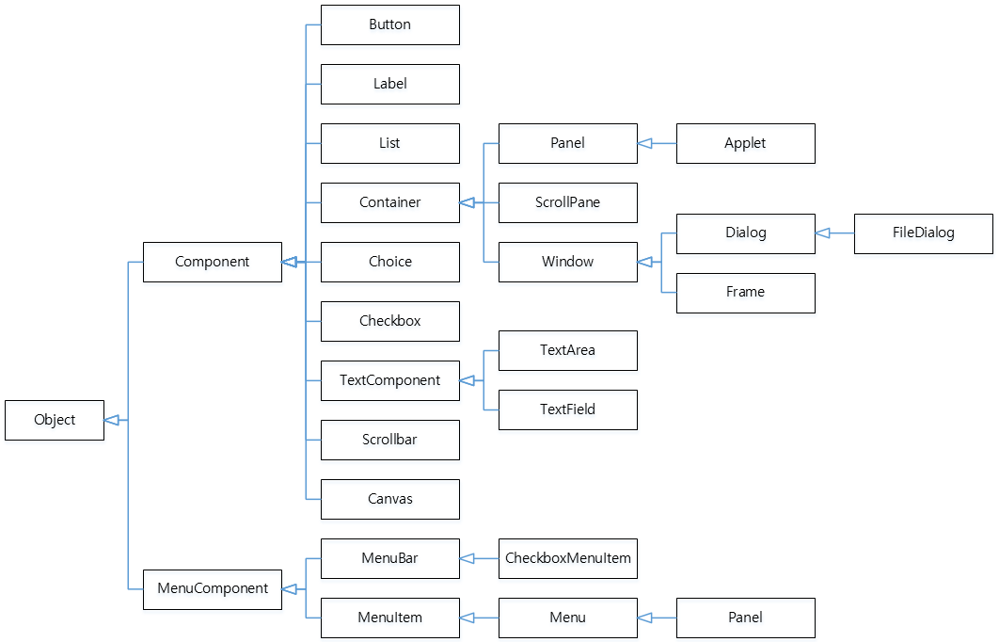
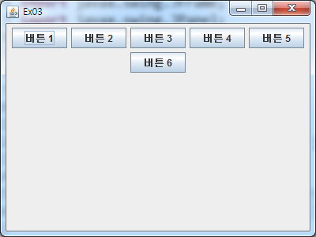
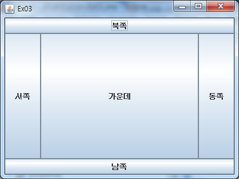

GUI 프로그래밍
===========

## 1. AWT
* java.awt 패키지 : GUI 구축을 위한 클래스들의 모임
* java.awt 패키지의 클래스 계층 구조

  

##### 1.1 Container 클래스
- 컴포넌트를 담는 그릇 역할을 하는 클래스
- Frame, Window, Dialog, FileDialog, Panel, Applet 등의 하위 클래스를 가지고 있다
  컨테이너는 서브(Sub) 컨테이너를 가질 수 있다.
- 일반적으로 서브 컨테이너로 Panel 클래스가 많이 사용된다.

## 2. 배치 관리자(Layout Manager)
- 레이아웃은 컴포넌트를 어떤 방식으로 위치시킬 것인지를 나타내는 것으로 AWT에 있는 Container들은 모든
  레이아웃 매니저(Layout Manager)라는 것을 포함하고 있으며 레이아웃 매니저는 컨테이너 객체에 소속되어
  있는 자식 컴포넌트들의 배치를 도와주는 객체이다.
  
##### 2.1 FlowLayout
- 컴포넌트를 일렬로 배치
 
  
   
##### 2.2 BorderLayout
- 컴포넌트를 추가할 때 방향을 지정하여 추가할 수 있는 기능을 제공, 지정할 수 있는 레이아웃 매니저
- 방향은 동, 서, 남, 북, 중앙 다섯개의 영역으로 배치한다.
- East, West, South, North, Center
- 생성자
  - BorderLayout()
  - BoderLayout(int hgap, int vgap)
  - hgap, vgap : 컴포넌트들 사이의 간격을 의미하며 픽셀단위로 지정
  - 컴포넌트를 추가하는 add() 메소드에 방향을 지정
  - void add(String name, Component comp)
         
  
   
     
  
