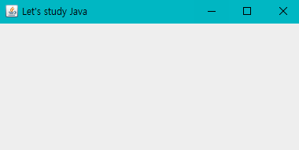
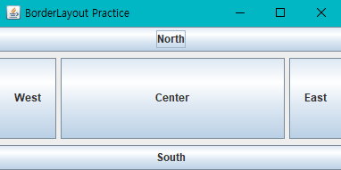
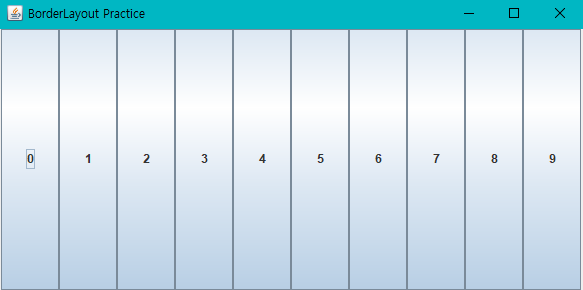
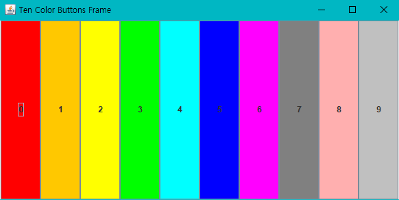
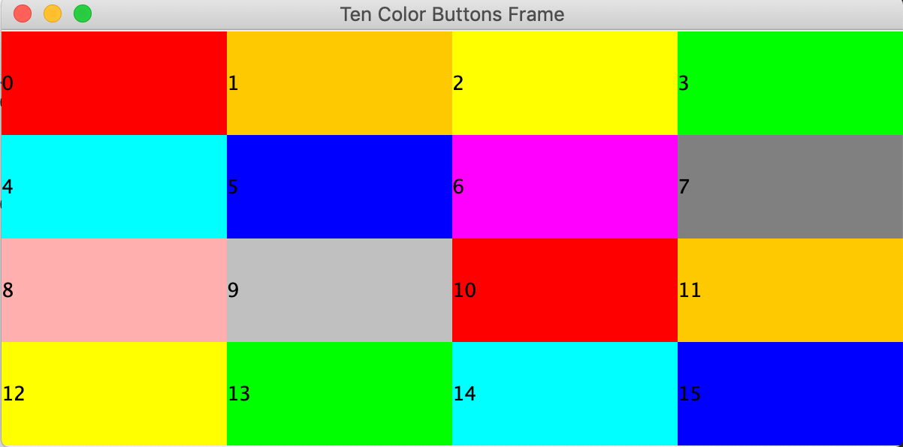
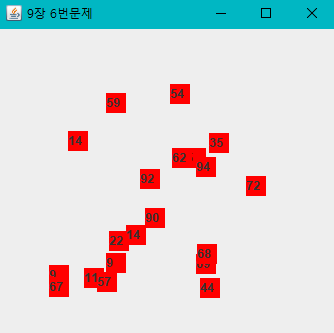

## GUI 실습문제
### 1. "Let's study Java"라는 문자열을 타이틀로 가지고 프레임의 크기가 400*200인 스윙 프로그램을 작성하라.
  
  
### 2. BoderLayout을 사용하여 컴포넌트 사이의 수평 수직 간격이 각각 5픽셀, 7픽셀이 되도록 스윙 응용프로그램을 작성하라.
    

### 3. GridLayout을 사용하여 다음 그림과 같이 한 줄에 10개의 버튼을 동일한 크기로 배치하는 스윙 프로그램을 작성하라.
    

### 4. 문제 3을 수정하여 다음 결과와 같이 각 버튼의 배경색을 서로 다르게 설정하라.
- 힌트
  - 컴포넌트의 배경색을 노란색으로 설정하려면 comp.setBackground(Color.YELLOW);로 하면된다.
    

### 5. GridLayout을 이용하여 다음 그림과 같이 16개의 색을 배경색으로 하는 4*4 바둑판을 구성하라.

- 힌트
  - 16개의 JLabel 컴포넌트를 생성하고 각 레이블 컴포넌트의 배경색을 칠한 다음 하나씩 GridLayout을 가진 컨테이너에 붙이면 된다.
    

### 6. 20개의 10*10 크기의 JLabel 컴포넌트가 프레임 내에 (50,50) 위치에서 (250,250) 영역에서 랜덤한 위치에 출력되도록 스윙프로그램을 작성하라. 프레임의 크기는 300*300으로 하라. 
- 힌트
  - JLabel 컴포넌트의 위치를 랜덤하게 설정하기 위해 (x,y) 좌표는 다음과 같이 구한다.
  
    
  

